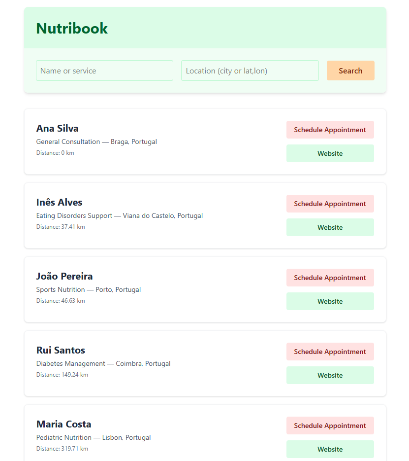

# Nutribook



A Ruby on Rails application that connects guests with nutritionists. Guests can search for nutritionists by name, service, or location, schedule appointments, and nutritionists can manage incoming requests through a real-time dashboard built with React.

## Tech Stack

- **Backend:** Ruby 4.0.1 · Rails 8.1
- **Frontend:** ERB templates + React 18 (dashboard) · Tailwind CSS 4
- **Database:** PostgreSQL 15
- **Asset Pipeline:** Propshaft · esbuild · Tailwind CLI
- **Geolocation:** Geocoder gem
- **Testing:** RSpec · FactoryBot
- **Deployment:** Docker

## Prerequisites

| Dependency | Version |
|------------|---------|
| Ruby       | 4.0.1   |
| Node.js    | 18.19.1 |
| Yarn       | 1.x+    |
| PostgreSQL | 15+     |
| Docker *(optional)* | Latest |

## Setup

### 1. Clone the repository

```bash
git clone <repository-url>
cd nutribook
```

### 2. Start PostgreSQL

The project ships a `docker-compose.yml` that runs Postgres with default credentials:

```bash
docker compose up -d
```

This starts PostgreSQL on `localhost:5432` with user `nutribook` and password `password`.

> [!NOTE]
> If you already have a local PostgreSQL instance you can skip this step and adjust `config/database.yml` as needed.

### 3. Install dependencies

```bash
bundle install
yarn install
```

### 4. Create and seed the database

```bash
bin/rails db:create db:migrate db:seed
```

The seed file creates 5 sample nutritionists with services across different Portuguese cities (Braga, Porto, Lisbon, Coimbra, Viana do Castelo).

## Running the Application

Use the dev `Procfile` to start all processes (Rails server, JS bundler, CSS compiler) at once:

```bash
bin/dev
```

This runs:
- **Web server** → `http://localhost:3000`
- **JS watcher** → esbuild in watch mode
- **CSS watcher** → Tailwind CLI in watch mode

Alternatively, start each process manually:

```bash
bin/rails server           # Rails on port 3000
yarn build --watch         # esbuild
yarn build:css --watch     # Tailwind CSS
```

## Running Tests

```bash
bundle exec rspec
```

## Project Structure

### Models

| Model | Description |
|-------|-------------|
| `Nutritionist` | Professional profile (name, email). Has many services. |
| `Service` | A service offered by a nutritionist (name, price, location, coordinates). Has many appointments. |
| `Appointment` | A booking request from a guest (guest name/email, start time, status). Belongs to a service. |

### Key Flows

- **Guest flow** — Browse nutritionists at the root path (`/`), search by name or location, and create appointment requests.
- **Nutritionist dashboard** — Access via `/dashboard/:nutritionist_id`. A React-powered interface that lists pending/accepted/rejected appointments with accept/reject actions. Updates are sent via email through `AppointmentMailer`.

### API Endpoints

| Method | Path | Description |
|--------|------|-------------|
| `GET` | `/nutritionists` | List & search nutritionists |
| `POST` | `/appointments` | Create an appointment request |
| `GET` | `/api/appointments` | Fetch appointments (JSON) |
| `PATCH` | `/api/appointments/:id/accept` | Accept an appointment |
| `PATCH` | `/api/appointments/:id/reject` | Reject an appointment |

## Design Decisions

- **No authentication** — The app uses a simplified trust model where nutritionists access their dashboard via a direct URL containing their ID. This keeps the focus on the core scheduling workflow.
- **Geocoder integration** — Services are geocoded by location string. Seed data sets coordinates directly to avoid external API calls during setup. Noticed some delays on the geocoder so opted to hardcode the coordinates for the seed data.
